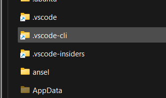

# Backup_link

## Descrição do Projeto

O **backup_link** é uma ferramenta desenvolvida para otimizar o gerenciamento de espaço em disco e garantir a segurança das configurações de aplicativos no sistema Windows. Ele soluciona dois problemas comuns:

1. **Espaço Limitado na Partição do Sistema:** Permite liberar espaço na partição principal do Windows, que geralmente é menor, movendo as pastas de configuração dos programas para outras partições ou unidades de armazenamento.
2. **Backup das Configurações de Aplicativos:** Garante que as configurações dos programas, que muitas vezes são salvas na pasta do usuário, estejam protegidas contra perda de dados ou reinstalação do sistema.

A solução utiliza links simbólicos, uma funcionalidade do Windows que redireciona o acesso a uma pasta para outro local, sem que o programa perceba a mudança. Isso permite manter a funcionalidade dos aplicativos sem comprometer o espaço na partição do sistema.



Além disso, o uso de links simbólicos permite que as pastas de configuração sejam armazenadas em serviços de armazenamento em nuvem, garantindo uma camada adicional de segurança e acessibilidade.

## Funcionalidades

* Criação de links simbólicos para pastas de configuração de aplicativos.
* Redirecionamento de pastas para outras partições ou unidades de armazenamento.
* Compatibilidade com serviços de armazenamento em nuvem.
* Ferramenta desenvolvida em Flutter, com desempenho eficiente.

## Pré-requisitos

* Sistema operacional Windows.
* Git instalado.
* Flutter SDK instalado e configurado.

## Instalação

1. Clone o repositório para sua máquina local:

    ```sh
    git clone https://github.com/marcoeli/backup_link.git
    ```

2. Navegue até o diretório do projeto:

    ```sh
    cd backup_link
    ```

3. Execute o comando para compilar o aplicativo Flutter para Windows:

    ```sh
    flutter build windows
    ```

4. O executável compilado se encontrará na pasta `build/windows/runner/release`.

## Utilização

Para utilizar o **backup_link**, execute o arquivo executável gerado. A interface do aplicativo guiará o usuário no processo de criação de links simbólicos para as pastas de configuração desejadas.

**Nota:** Se for fazer backup, apagar ou criar symlink em pastas protegidas, é necessário executar o programa em modo administrador.

## Contribuição

Contribuições são sempre bem-vindas! Se você tiver ideias de melhorias, correções de bugs ou novas funcionalidades, sinta-se à vontade para abrir uma *issue* ou enviar um *pull request*.

## Licença

Este projeto é licenciado sob a licença MIT. Consulte o arquivo `LICENSE` para obter mais detalhes.

## Recursos Adicionais

* [Documentação do Flutter](https://docs.flutter.dev/)

**Importante:** Apesar de o projeto ser desenvolvido em um framework multiplataforma, sua funcionalidade será exclusiva para Windows.

---

## Backup_link (English)

## Project Description

**backup_link** is a tool designed to optimize disk space management and ensure the security of application settings on the Windows system. It solves two common problems:

1. **Limited Space on System Partition:** Allows freeing up space on the main Windows partition, which is usually smaller, by moving program configuration folders to other partitions or storage drives.
2. **Backup of Application Settings:** Ensures that program settings, which are often saved in the user folder, are protected against data loss or system reinstallation.

The solution uses symbolic links, a Windows feature that redirects access to a folder to another location without the program noticing the change. This allows maintaining the functionality of applications without compromising space on the system partition.


Additionally, using symbolic links allows configuration folders to be stored in cloud storage services, providing an additional layer of security and accessibility.

## Features

* Creation of symbolic links for application configuration folders.
* Redirection of folders to other partitions or storage drives.
* Compatibility with cloud storage services.
* Tool developed in Flutter, with efficient performance.

## Prerequisites

* Windows operating system.
* Git installed.
* Flutter SDK installed and configured.

## Installation

1. Clone the repository to your local machine:

    ```sh
    git clone https://github.com/marcoeli/backup_link.git
    ```

2. Navigate to the project directory:

    ```sh
    cd backup_link
    ```

3. Run the command to compile the Flutter application for Windows:

    ```sh
    flutter build windows
    ```

4. The compiled executable will be located in the `build/windows/runner/release` folder.

## Usage

To use **backup_link**, run the generated executable file. The application's interface will guide the user through the process of creating symbolic links for the desired configuration folders.

**Note:** If you are backing up, deleting, or creating symlinks in protected folders, you need to run the program in administrator mode.

## Contribution

Contributions are always welcome! If you have ideas for improvements, bug fixes, or new features, feel free to open an issue or submit a pull request.

## License

This project is licensed under the MIT license. See the `LICENSE` file for more details.

## Additional Resources

* [Flutter Documentation](https://docs.flutter.dev/)

**Important:** Although the project is developed in a cross-platform framework, its functionality will be exclusive to Windows.
